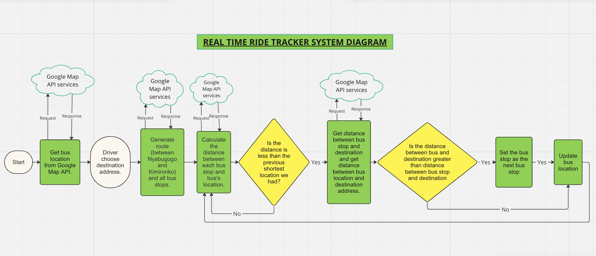
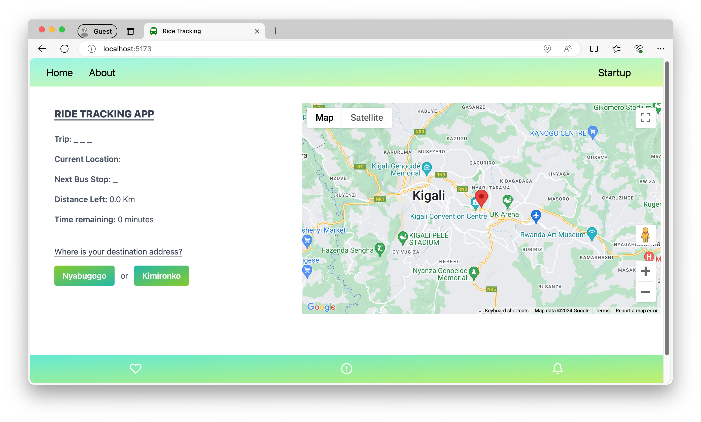
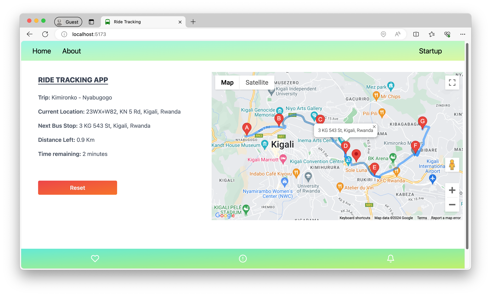

# Kigali Real Time Ride Tracker

### Introduction
The Kigali Real-Time Ride Tracker is an application designed to assist drivers with a transportation agency in Kigali while navigating between the Nyabugogo and Kimironko bus stops.

### Features
1. Real-time bus location tracking
2. Next bus stop information
3. Distance to the next bus stop
4. Estimated time of arrival (ETA) at the next bus stop

### Technology used
1. Frontend: ReactJs
2. Backend: NodeJs (ExpressJs)
3. Location tracking: Google Map Api service

### System analyis

## Local setup and installation
### Requirements
1. NodeJS installed
2. Web browser
3. Personal computer with GPS enabled (or mobile phone)

### Local Setup
1. Clone the repository `git clone {url}`
2. Go to download location `cd {folder_name}`
3. Install node packages `npm install`
4. Get Google Map API keys at https://developers.google.com/maps/documentation/javascript/get-api-key
5. Add your API keys in the file `src/config/Keys.js`

### Starting the project
1. On the root of directory run `node server.js`. This will start the backend at http://localhost:5000 which will be used to request for data from Google Map on behalf of the application.
2. Open another terminal and run `npm run dev`. This will start frontend of application locally.
3. In the browser, open the frontend of application and allow browser to access your location.

### Troubleshooting
1. Ensure you have assigned the correct Google Maps API key to the GOOGLE_MAP_KEYS variable in the src/config/Keys.js file.
2. Verify that the backend server is running at http://localhost:5000. If not, adjust the backend server address in the Keys.js file if necessary.
3. Make sure you have granted location access to both the web browser and the local application.

### Screenshoots

